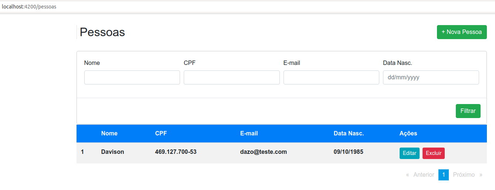
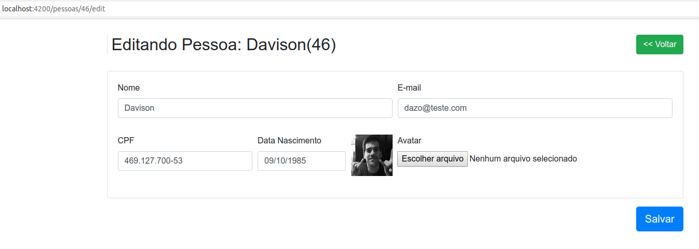

# Crud Pessoa

 A idéia do projeto é um crud de Pessoa, ou seja, é possível listar, cadastrar, editar e excluir(logicamente).
 
 Segue imagens de como ficou:
 
 <h1 align="center">
    
</h1>

<h1 align="center">
    
</h1>
 
# Tecnologias:

Este projeto utiliza as seguinte tecnologias no backend: 
   - Spring Boot 2.2.5 (com java 11)
   - Postgres
   - Flyway
   - Maven 3
   
Já no frontend: 
  - Angular 9
  - Bootstrap 4
  - Ngx-mask 8
  - Ngx-pagination 5
  - Ngx-toastr 12
  
# Para fazer o deploy da aplicação: 

  - Para o backend:
  
    1 - Instalar o Postgres e ajustar o arquivo application.properties, onde deve ser configurada a 
    string de conexão para o banco no parametro spring.datasource.url.
    
    2 - Instalar o Java 11.
    
    3 - Instalar o Maven 3.
    
    4 - Executar o comando clean instal no projeto, que gerará o arquivo "pessoa-1.0.0-SNAPSHOT.jar" 
        do projeto na pasta target.
        
    5 - Por fim executar o comando java -jar no arquivo "pessoa-1.0.0-SNAPSHOT.jar".
  
  - Para o front end:
  
    1 - Instalar o nginx.
    
    2 - Instalar o node.
    
    3 - Apos publicado a api, configurar o arquivo environment.prod.ts com a url da api.
    
    4 - Executar os comandos "npm install; ng build --prod;" para compilar e gerar a past dist no projeto.
    
    5 - Colocar o diretório da pasta dist dentro dos sites-available do nginx. 
 
**O projeto estará disponível no contexto /pessoas.**

# Documentação:

 O projeto backend está formatado da seguinte forma:
  
  - PessoaEntity - responsável pela camada de modelo.
  
  - PessoaResource - responsável pela camada de controller de requisições rest.
  
  - PessoaRepository, PessoaFilter, PessoaSpecification - responsáveis pela camada de persistência.
  
  - PessoaService - responsável pela camada de negócio da aplicação.
  
  - DetalheException, ResourceExceptionHandler - responsáveis pelo tratamento de erros.
  
  - PessoaValidacaoException, PessoaNaoEncontradaException - responsáveis pelos erros da aplicação.
  
  - WebConfig, application.properties - responsáveis pelas configurações necessárias para rodar no Spring. (Internacionalização e Cors) 
  
  - db.migration - Arquivos com comandos SQL para aplicar no Postgres

  - messages.properties e messages_en_US.properties - responsáveis pelas mensagens internacionalizadas.
 
 O projeto frontend esta formatado da seguinte forma (a partir da pasta app):
 
  - pasta compartilhado - existem dois componentes que auxiliarão na exibição de erro do field(form-field-error)
    e erros do oriundos do backend(server-error-messages).
    
  - pasta paginas/pessoa
    
    - pasta pessoa-form - arquivos responsáveis pelo cadastro e edição da pessoa
    
    - pasta pessoa-lista - arquivos responsáveis pela lista, paginação e filtro.
    
    - pasta compartilhado - arquivos reusados entre os componentes tais como service e model
    
  - enviroments - variáveis de ambiente do projeto
